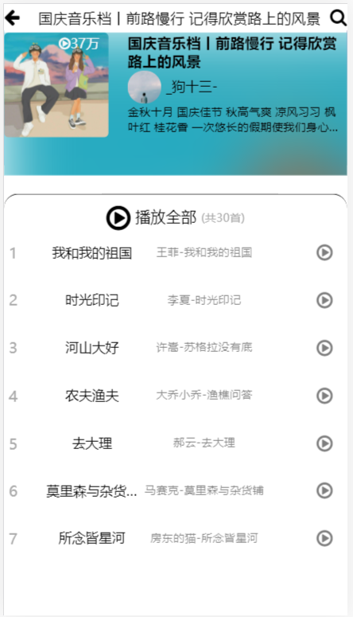
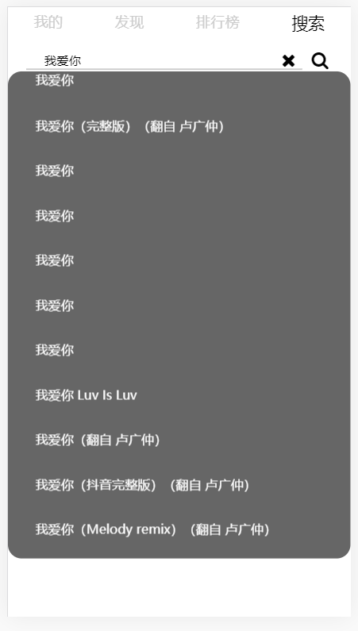
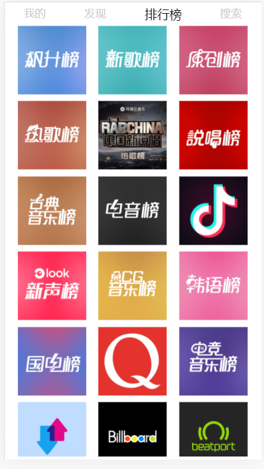
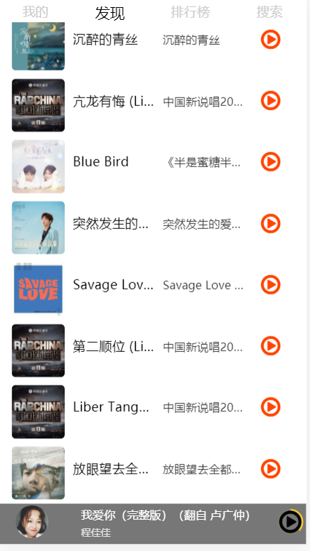
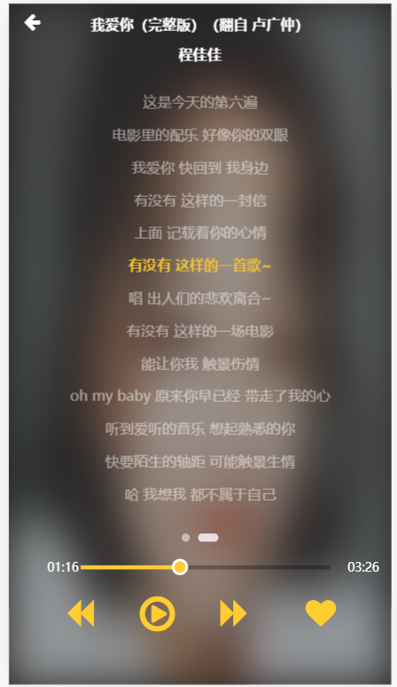

# vue-music

线上地址：[]:http://47.106.165.163/

后端使用使用**Binaryify**大佬提供的接口，项目地址：[]:https://github.com/Binaryify/NeteaseCloudMusicApi

手机扫码体验更好：

使用vue全家桶和better-scroll仿的网易云手机端app,主要实现了以下几个功能：

* 用户登录

  

* 用户详情

  

* 首页

  

* 歌单

  

* 歌单详情

  

* 搜索

  

* 排行榜

  

* 音乐播放

  

    	

* 歌词

  